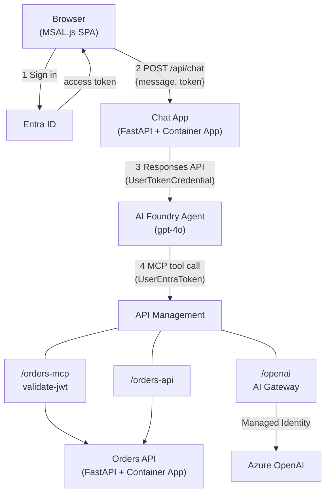
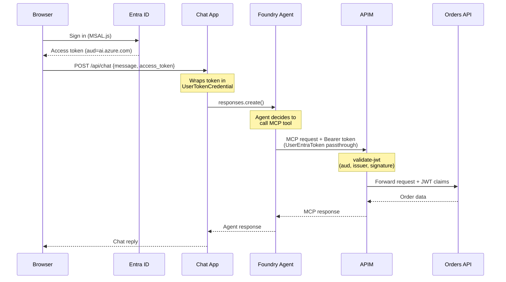
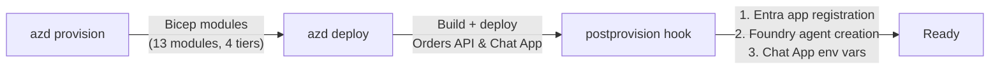

# Propagate ID Entra

**End-to-end identity propagation from browser through AI agents to backend APIs — no service accounts in the data path.**

[](https://learn.microsoft.com/azure/developer/azure-developer-cli/)
[](https://www.python.org/)
[](https://learn.microsoft.com/azure/azure-resource-manager/bicep/)
[](LICENSE)

> A proof-of-concept showing how a user's Entra ID token can flow from a browser, through an AI Foundry agent with MCP tools, through API Management, all the way to a backend API — preserving the caller's identity at every hop. Deployed with a single `azd up`.

## Architecture



## How Identity Flows



| Hop | Auth Type | User Identity Preserved? |
|-----|-----------|--------------------------|
| Browser → Chat App → Foundry | Delegated (MSAL.js access token) | Yes |
| Foundry → APIM MCP | UserEntraToken passthrough | Yes |
| APIM → Azure OpenAI | Managed Identity (service-to-service) | No |

> [!IMPORTANT]
> No OAuth2 client credentials, no consent prompts, no client secrets, no refresh token expiry. The user's existing Entra token is passed directly at every hop via a **UserEntraToken** connection.

## Quick Start

> [!TIP]
> `azd up` does everything: provisions Azure resources via Bicep, builds and deploys containers to ACR, then runs a post-provision hook to create the Entra app registration and Foundry agent.

### Prerequisites

- **Azure subscription** with Owner/Contributor access
- **Azure CLI** (`az`) — logged in
- **Azure Developer CLI** (`azd`)
- **Python** 3.9+
- **Git**

Docker is not required locally — container builds run remotely on ACR.

### Deploy

```bash
git clone https://github.com/ozgurkarahan/propagate-id-entra.git
cd propagate-id-entra
azd env new propagate-id-entra
azd up
```

### Verify

```bash
python scripts/verify_deployment.py
python scripts/test-agent.py
```

## What `azd up` Does



## Project Structure

<details>
<summary>Click to expand</summary>

| Path | Description |
|------|-------------|
| `infra/main.bicep` | Subscription-scoped Bicep orchestrator |
| `infra/modules/` | 13 Bicep modules (APIM, Cognitive, Container Apps, etc.) |
| `infra/policies/` | APIM policies (JWT validation, AI Gateway, RFC 9728 PRM) |
| `src/orders-api/` | FastAPI Orders CRUD backend (6 endpoints, 8 seed orders) |
| `src/chat-app/` | FastAPI backend + vanilla JS SPA with MSAL.js |
| `hooks/postprovision.py` | Entra app registration + Foundry agent creation |
| `scripts/` | Deployment verification, diagnostics, agent testing |
| `docs/` | Deep-dive architecture, identity & security, reference docs |

</details>

## Learn More

- [**Identity & Security Architecture**](docs/identity-security.md) — Entra app registration, managed identities, JWT validation, RFC 9728, security design decisions
- [**Deep Dive**](docs/deep-dive.md) — ARM resource details, data flows, step-by-step build guide
- [**AGENT.md**](AGENT.md) — Architecture diagrams, auth flow details, IaC principles, development reference

## License

[MIT](LICENSE)
