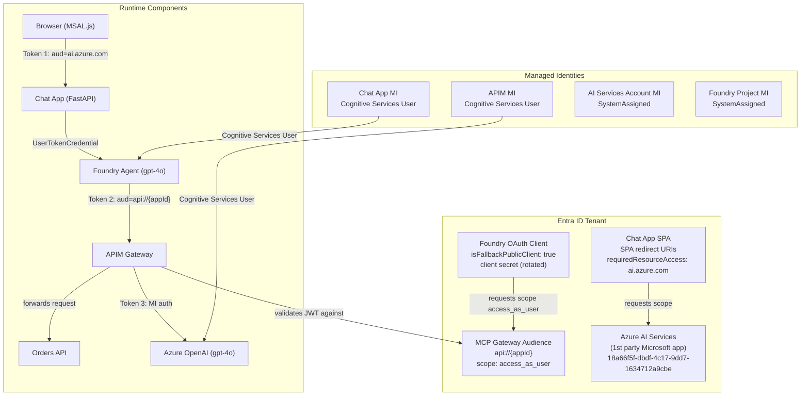
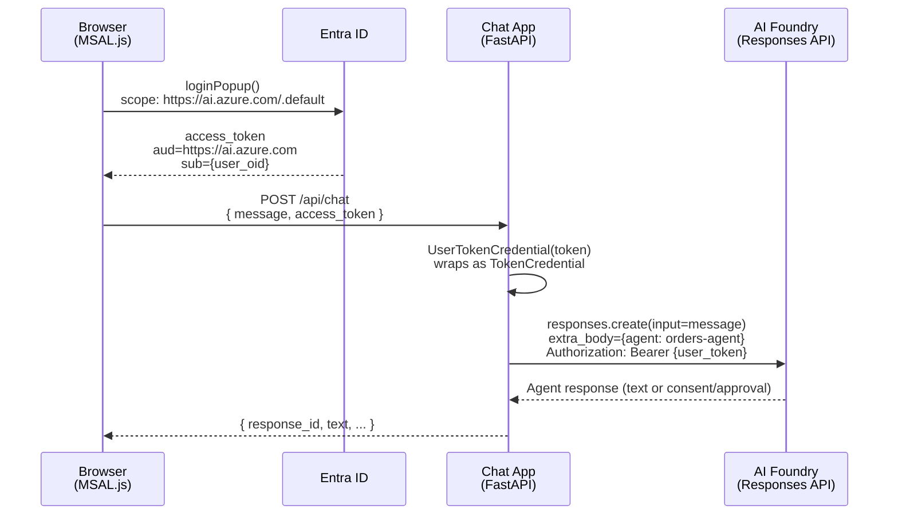
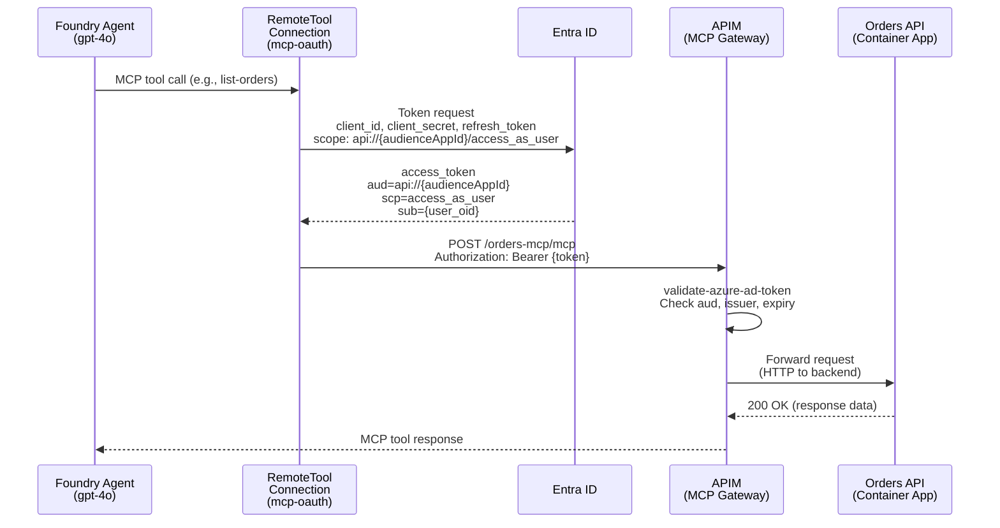
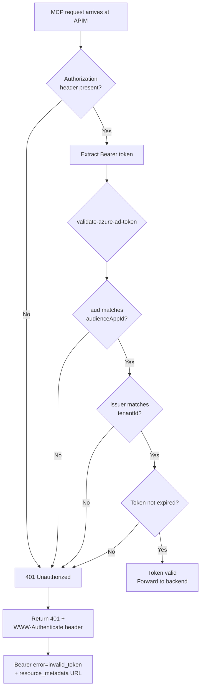
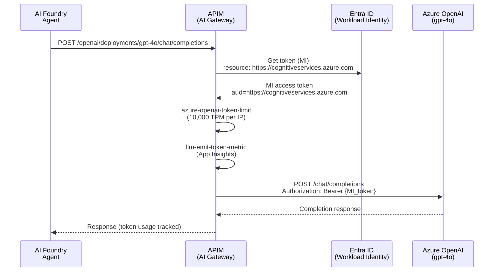
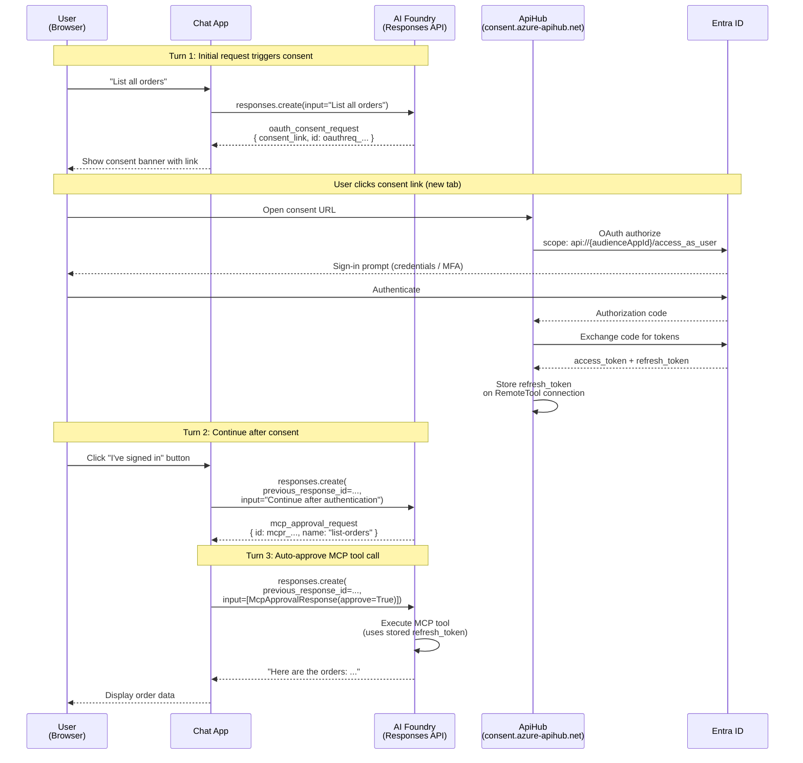
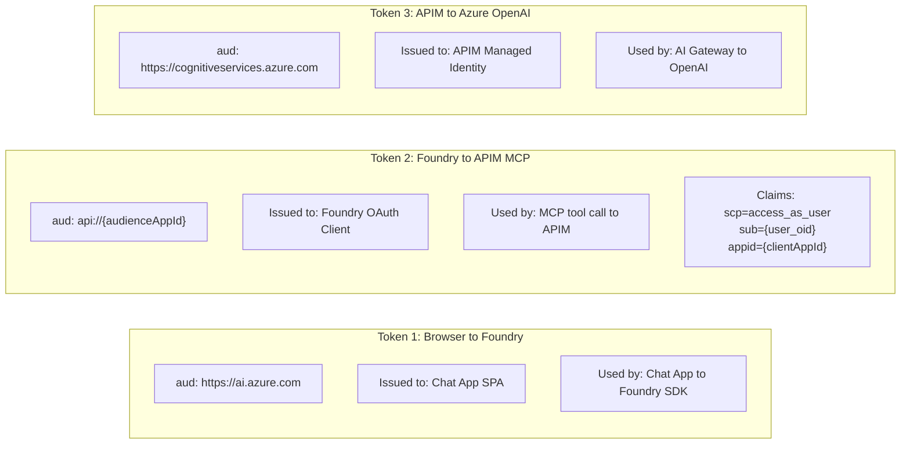

# Identity & Security Architecture

## 1. Introduction

This document describes the identity and security architecture of the Identity Propagation PoC. It covers every Entra ID app registration, managed identity, auth flow, OAuth consent mechanism, and APIM token validation policy in the system.

**Core principle: no service accounts in the data path.** A user's identity propagates end-to-end from the browser through the AI agent to the backend API. The only managed-identity flow is the AI Gateway path (APIM to Azure OpenAI), which is outside the user data path.

**Scope:** 3 Entra app registrations, 4 managed identities, 3 distinct auth flows, an OAuth consent mechanism, APIM JWT validation with RFC 9728 Protected Resource Metadata, and all supporting configuration across Bicep, postprovision hook, APIM policies, and application code.

---

## 2. Identity Components

### Overview



### Entra App Registrations

All three apps are created by the **postprovision hook** (`hooks/postprovision.py`) using `az` CLI with delegated permissions. The ARM deployment identity lacks `Application.ReadWrite.All` in managed tenants, so the Graph Bicep extension cannot be used.

| Property | MCP Gateway Audience | Foundry OAuth Client | Chat App SPA |
|----------|---------------------|---------------------|--------------|
| **Display Name** | `MCP Gateway Audience ({env})` | `Foundry OAuth Client ({env})` | `Chat App ({env})` |
| **Purpose** | Defines the API that MCP bearer tokens authenticate against | OAuth client Foundry uses to acquire delegated tokens for MCP | Browser MSAL.js authentication for Chat UI |
| **App Type** | API (resource server) | Public client (`isFallbackPublicClient: true`) | Public client (`isFallbackPublicClient: true`) |
| **Sign-in Audience** | `AzureADMyOrg` (single tenant) | `AzureADMyOrg` (single tenant) | `AzureADMyOrg` (single tenant) |
| **Identifier URI** | `api://{appId}` | None | None |
| **Exposed Scopes** | `access_as_user` (UUID5 deterministic ID) | None | None |
| **Required Resource Access** | None | MCP Gateway Audience / `access_as_user` | Azure AI Services / `user_impersonation` (`18a66f5f-dbdf-4c17-9dd7-1634712a9cbe`) |
| **Redirect URIs** | None | `https://ai.azure.com/auth/callback`, `https://global.consent.azure-apim.net/redirect/{connectorId}` | SPA: `http://localhost:8080`, `https://{chatAppFqdn}` |
| **Credentials** | None | Client secret (reset on each `azd up`) | None (public SPA) |
| **Created By** | Hook Step 1 ([1/7]) | Hook Step 1 ([3/7]) | Hook Step 1b |
| **azd Env Var** | `MCP_AUDIENCE_APP_ID` | `MCP_OAUTH_CLIENT_ID` | `CHAT_APP_ENTRA_CLIENT_ID` |

### Managed Identities

| Identity | Resource | Type | RBAC Role | Scope | Purpose |
|----------|----------|------|-----------|-------|---------|
| APIM MI | `apim-{env}` | SystemAssigned | `Cognitive Services User` | AI Services account (`aoai-{env}`) | Authenticate to Azure OpenAI via `authentication-managed-identity` policy |
| Chat App MI | `ca-chat-app` | SystemAssigned | `Cognitive Services User` | AI Services account (`aoai-{env}`) | Available for service-to-service auth (not used in data path; user token used instead) |
| AI Services MI | `aoai-{env}` | SystemAssigned | (none assigned) | N/A | Resource-level identity for the CognitiveServices account |
| Foundry Project MI | `aiproj-{env}` | SystemAssigned | (none assigned) | N/A | Resource-level identity for the Foundry project |

**RBAC role assignments** are deployed via `infra/modules/role-assignment.bicep`:
- Role: `Cognitive Services User` (`a97b65f3-24c7-4388-baec-2e87135dc908`)
- Assignment name: `guid(accountId, principalId, roleDefinitionId)` (deterministic)

---

## 3. Flow A: User to Chat App to Foundry (Delegated Identity)

### Narrative

1. **MSAL.js login** — The user clicks "Sign in" in the browser. MSAL.js opens a popup to `https://login.microsoftonline.com/{tenantId}` requesting `scope: https://ai.azure.com/.default`.
2. **Token acquisition** — Entra ID returns an access token with `aud=https://ai.azure.com` and the user's `oid`/`sub` claims. MSAL.js caches the token in `sessionStorage`.
3. **Chat request** — The browser sends `POST /api/chat { message, access_token }` to the Chat App backend. The access token is passed in the request body (not an Authorization header).
4. **UserTokenCredential** — The Chat App wraps the user's token in a `UserTokenCredential` class that implements the `TokenCredential` interface. This makes the Foundry SDK carry the user's identity.
5. **Foundry SDK call** — `AIProjectClient(endpoint, credential)` is instantiated with the wrapped token. The chat handler calls `openai_client.responses.create()` with `extra_body={"agent": {"name": "orders-agent", "type": "agent_reference"}}`.
6. **Identity propagation** — The Foundry service receives the request authenticated as the user, not as a service principal. The user's identity is preserved for downstream MCP tool calls.

### Sequence Diagram



### Configuration

| Setting | Value | Source |
|---------|-------|--------|
| SPA Client ID | `CHAT_APP_ENTRA_CLIENT_ID` | Postprovision hook Step 1b |
| Authority | `https://login.microsoftonline.com/{tenantId}` | `/api/config` endpoint |
| Scopes | `["https://ai.azure.com/.default"]` | `/api/config` endpoint |
| Foundry Endpoint | `AI_FOUNDRY_PROJECT_ENDPOINT` | Bicep output (`cognitive.outputs.projectEndpoint`) |
| Agent Name | `AGENT_NAME` (default: `orders-agent`) | Container App env var |
| Resource App ID | `18a66f5f-dbdf-4c17-9dd7-1634712a9cbe` (Azure Machine Learning Services) | SPA `requiredResourceAccess` |
| Scope Permission ID | `1a7925b5-f871-417a-9b8b-303f9f29fa10` (`user_impersonation`) | SPA `requiredResourceAccess` |

### Key Design Decisions

- **Token in request body, not Authorization header:** The SPA sends the access token inside the JSON body rather than as a Bearer header. This avoids CORS preflight complexity and keeps the Chat App stateless.
- **Single-audience credential:** `UserTokenCredential` serves a single audience (`https://ai.azure.com`). The chat handler must not call APIs that require different audiences (e.g., `agents.list()` would fail).
- **Managed identity available but unused in data path:** The Chat App has a `SystemAssigned` MI with `Cognitive Services User` role, but it is not used for agent calls. The user's own token is passed through to preserve identity propagation.

---

## 4. Flow B: Foundry Agent to MCP Server via APIM (OAuth Delegated)

### Narrative

1. **Agent decides to call MCP tool** — When the agent determines it needs to call an MCP tool (e.g., `list-orders`), it looks up the `mcp-oauth` RemoteTool connection on the Foundry project.
2. **Token acquisition** — The Foundry Agent Service uses the OAuth credentials stored on the RemoteTool connection (client ID, client secret, refresh token) to acquire a delegated access token from Entra ID. The token scope is `api://{audienceAppId}/access_as_user`.
3. **Bearer token sent to APIM** — The agent sends `POST /orders-mcp/mcp` to APIM with `Authorization: Bearer {token}`.
4. **APIM validates JWT** — The `validate-azure-ad-token` policy checks: audience matches `api://{audienceAppId}`, issuer matches `https://sts.windows.net/{tenantId}/`, token is not expired.
5. **Request forwarded** — If valid, APIM forwards the request to the Orders API Container App backend.
6. **401 challenge on failure** — If validation fails, APIM returns `401 Unauthorized` with a `WWW-Authenticate` header pointing to the RFC 9728 Protected Resource Metadata endpoint.

### Sequence Diagram



### RemoteTool Connection Configuration

The connection is initially deployed via Bicep (`infra/modules/mcp-oauth-connection.bicep`) with placeholder values, then **deleted and recreated** by the postprovision hook via ARM REST PUT to trigger ApiHub connector registration.

| Property | Value | Source |
|----------|-------|--------|
| `category` | `RemoteTool` | Required for Agent Service OAuth recognition |
| `group` | `GenericProtocol` | Required alongside RemoteTool |
| `authType` | `OAuth2` | OAuth2 delegated flow |
| `target` | `{apimGatewayUrl}/orders-mcp/mcp` | APIM MCP endpoint |
| `metadata.type` | `custom_MCP` | Identifies as MCP connection |
| `connectorName` | `mcp-oauth` | Connection identifier |
| `credentials.clientId` | `{Foundry OAuth Client appId}` | From hook Step 1 |
| `credentials.clientSecret` | `{rotated secret}` | From hook Step 6 |
| `authorizationUrl` | `https://login.microsoftonline.com/{tenantId}/oauth2/v2.0/authorize` | Entra v2.0 endpoint |
| `tokenUrl` | `https://login.microsoftonline.com/{tenantId}/oauth2/v2.0/token` | Entra v2.0 endpoint |
| `refreshUrl` | `https://login.microsoftonline.com/{tenantId}/oauth2/v2.0/token` | Same as tokenUrl |
| `scopes` | `["api://{audienceAppId}/access_as_user"]` | MCP Gateway Audience scope |
| `isSharedToAll` | `true` | Shared to all project users |

**Why DELETE + PUT?** Bicep-created RemoteTool connections do **not** register the ApiHub connector that Foundry needs for interactive OAuth consent. The postprovision hook must DELETE the Bicep-created connection and PUT a fresh one via ARM REST to trigger ApiHub setup. Without this, Agent Service fails with "Failed to create ApiHub connection: Not Found".

### APIM Token Validation

The `validate-azure-ad-token` policy is applied at the MCP API level (`infra/policies/mcp-api-policy.xml`):

```xml
<validate-azure-ad-token tenant-id="{{McpTenantId}}"
    failed-validation-httpcode="401"
    failed-validation-error-message="Unauthorized">
    <audiences>
        <audience>{{McpAudienceAppId}}</audience>
    </audiences>
</validate-azure-ad-token>
```

On failure, the `on-error` section returns a 401 with a `WWW-Authenticate` header:

```
Bearer error="invalid_token", resource_metadata="{gateway}/orders-mcp/.well-known/oauth-protected-resource"
```

#### Token Validation Flowchart



### RFC 9728 Protected Resource Metadata

The PRM endpoint enables MCP clients to auto-discover the OAuth configuration needed to authenticate. It is served by a separate HTTP API (`orders-mcp-prm`) because MCP-type APIs do not support custom operations.

**Endpoint:** `GET {gateway}/orders-mcp/.well-known/oauth-protected-resource`

**Response** (generated by `infra/policies/mcp-prm-policy.xml`):

```json
{
  "resource": "{gateway}/orders-mcp/mcp",
  "authorization_servers": [
    "https://login.microsoftonline.com/{tenantId}/v2.0"
  ],
  "bearer_methods_supported": ["header"],
  "scopes_supported": [
    "api://{audienceAppId}/access_as_user"
  ]
}
```

- Served anonymously (no auth required)
- Cached: `Cache-Control: public, max-age=3600`
- The `resource` field matches the connection `target` (APIM MCP endpoint)

### APIM Named Values

| Named Value | Purpose | Initial Value | Final Value |
|-------------|---------|---------------|-------------|
| `McpTenantId` | Tenant ID for issuer validation | `tenant().tenantId` (Bicep) | Tenant ID (set at deploy) |
| `McpAudienceAppId` | Audience for JWT validation | `placeholder-updated-by-hook` | `api://{appId}` (hook Step 2) |
| `APIMGatewayURL` | Gateway URL for PRM response | `apim.properties.gatewayUrl` (Bicep) | Gateway URL (set at deploy) |

---

## 5. Flow C: APIM to Azure OpenAI (Managed Identity)

### Narrative

The AI Gateway flow uses **managed identity** authentication. When the Foundry agent calls the Azure OpenAI API through APIM, the APIM `authentication-managed-identity` policy acquires a token using APIM's system-assigned managed identity. No user tokens are involved — this is pure service-to-service auth.

This flow is separate from the user data path. It handles the agent's own LLM inference calls.

### Sequence Diagram



### Configuration

| Setting | Value | Source |
|---------|-------|--------|
| APIM Identity | `SystemAssigned` | `infra/modules/apim.bicep` |
| RBAC Role | `Cognitive Services User` | `infra/modules/role-assignment.bicep` |
| RBAC Scope | AI Services account (`aoai-{env}`) | `infra/main.bicep` (module `apim-cognitive-role`) |
| Policy: `authentication-managed-identity` | `resource=https://cognitiveservices.azure.com` | `infra/policies/ai-gateway-policy.xml` |
| Policy: `azure-openai-token-limit` | 10,000 TPM per IP | `infra/policies/ai-gateway-policy.xml` |
| Policy: `llm-emit-token-metric` | Dimensions: API ID, Operation ID, Client IP, Deployment | `infra/policies/ai-gateway-policy.xml` |
| Backend | `openai-backend` → `{cognitiveEndpoint}openai` | `infra/modules/apim.bicep` |

---

## 6. OAuth Consent Flow

### Why Consent Is Needed

The first time a user interacts with the agent, the Foundry Agent Service needs to acquire a delegated OAuth token on behalf of the user. Since the RemoteTool connection may not yet have a refresh token stored for this user, Foundry triggers an interactive OAuth consent flow via the ApiHub infrastructure (the same infrastructure used by Azure Logic Apps connectors).

Consent is **one-time per user per connection**. After the user authenticates and authorizes the `access_as_user` scope, ApiHub stores the refresh token on the connection. Subsequent calls use the stored refresh token silently.

### Multi-Turn Sequence Diagram



### Consent Infrastructure Details

**ConnectorId format:** `{projectInternalId-as-guid}-{connectionName}`
- The project's `internalId` is a 32-character hex string from the project's ARM properties
- Formatted as a GUID: `{8}-{4}-{4}-{4}-{12}` (e.g., `a1b2c3d4-e5f6-7890-abcd-ef1234567890`)
- Example connectorId: `a1b2c3d4-e5f6-7890-abcd-ef1234567890-mcp-oauth`

**Redirect URI construction:**
```
https://global.consent.azure-apim.net/redirect/{connectorId}
```
This URI is added to the Foundry OAuth Client app's `web.redirectUris` by the postprovision hook.

**Per-user token storage:** ApiHub stores the refresh token per user on the connection. Each user who consents gets their own stored credential.

### Fallback: Device Code Flow

When interactive browser consent is not possible (e.g., headless environments), the `scripts/grant-mcp-consent.py` script provides an alternative:

1. Initiates device code flow with `MCP_OAUTH_CLIENT_ID`
2. User authenticates at `https://microsoft.com/devicelogin`
3. Script receives `access_token + refresh_token`
4. Stores the refresh token on the connection via ARM REST PUT

The script auto-detects whether the client is public or confidential (retry logic for AADSTS7000218/AADSTS700025).

### Responses API Output Item Types

| Type | Field | Description |
|------|-------|-------------|
| `oauth_consent_request` | `consent_link` | URL for user to authenticate via ApiHub |
| `oauth_consent_request` | `id` | Request ID (prefix: `oauthreq_...`) |
| `mcp_approval_request` | `id` | Approval request ID (prefix: `mcpr_...`) |
| `mcp_approval_request` | `name` | Tool name (e.g., `list-orders`) |
| `mcp_approval_request` | `server_label` | MCP server label (e.g., `orders_mcp`) |
| `mcp_approval_request` | `arguments` | Tool call arguments (dict) |
| `message` | `content[].text` | Agent text response |

---

## 7. Token Audiences Summary

### Visual Overview



### Summary Table

| Flow | Audience | Issued To | Auth Type | User Identity Propagated? |
|------|----------|-----------|-----------|--------------------------|
| Browser to Foundry | `https://ai.azure.com` | Chat App SPA (MSAL.js) | Delegated (user interactive) | Yes |
| Foundry to APIM MCP | `api://{audienceAppId}` | Foundry OAuth Client (RemoteTool) | Delegated (token exchange via refresh token) | Yes (`sub={user_oid}`, `scp=access_as_user`) |
| APIM to Azure OpenAI | `https://cognitiveservices.azure.com` | APIM system-assigned MI | App-only (managed identity) | No (service identity) |

This is the most common source of configuration errors. Each component expects a specific audience — using the wrong one results in `401 Unauthorized` or `AADSTS650057`.

---

## 8. Security Design Decisions

1. **No service accounts in the data path.** User identity propagates from browser through agent to API. The only MI-based flow is AI Gateway (APIM to OpenAI), which is outside the user data path.

2. **Delegated OAuth, not app-only.** The Foundry-to-APIM flow uses delegated permissions (`access_as_user` scope), meaning the token carries both the user's identity (`sub`) and the client app identity (`appid`). This enables per-user audit trails in APIM logs.

3. **Public clients for SPA and device code.** Both the Chat App SPA and the Foundry OAuth Client use `isFallbackPublicClient: true`. The SPA cannot securely store secrets (browser). The OAuth Client needs public client mode for device code flow in the fallback consent script.

4. **Single-tenant apps only.** All three apps use `signInAudience: AzureADMyOrg`. This restricts authentication to users in the PoC tenant only, preventing cross-tenant access.

5. **Response body logging disabled for MCP.** APIM Application Insights response body logging at the All APIs scope **breaks MCP SSE streaming**. Response buffering interferes with the SSE transport, causing the MCP endpoint to hang indefinitely. Frontend and backend response body bytes are set to `0` in the global diagnostics configuration (`infra/modules/apim.bicep`).

6. **Client secret rotation on each deployment.** Every `azd up` runs `az ad app credential reset` (without `--append`), generating a new client secret and replacing the old one. This limits the exposure window of any leaked credential. The tradeoff is that the OAuth connection must be updated after each deployment.

7. **Deterministic scope ID.** The `access_as_user` scope uses a UUID5-based ID: `uuid5(NAMESPACE_URL, 'mcp-access-as-user/{tenantId}')`. This ensures the scope ID is stable across re-runs of the postprovision hook, avoiding orphaned permission grants.

8. **RFC 9728 Protected Resource Metadata.** The PRM endpoint at `/.well-known/oauth-protected-resource` enables MCP clients to auto-discover the authorization server, supported scopes, and bearer methods. This follows the standard for protected resource metadata rather than requiring out-of-band configuration.

9. **Admin consent grant (AllPrincipals).** The postprovision hook creates an `oauth2PermissionGrants` entry with `consentType: AllPrincipals`. This pre-authorizes all users in the tenant to use the `access_as_user` scope without individual consent prompts at the Entra ID level. (ApiHub consent is still required separately.)

10. **Backend trust boundary (APIM as gateway).** The Orders API Container App does not perform its own authentication — it trusts APIM as the security boundary. All token validation happens at the APIM layer. This is acceptable for a PoC; production would add backend auth.

---

## 8.5. Sign-in Log Auditing

### Overview

The Foundry/ApiHub OAuth pipeline is opaque — when Foundry acquires a token via ApiHub to call the MCP endpoint, the token issuance step does not appear in APIM gateway logs or Application Insights. **Entra ID sign-in logs** (`auditLogs/signIns` via Microsoft Graph API) fill this visibility gap by recording every token issuance event for all 3 Entra app registrations.

### What Each Auth Flow Produces in Sign-in Logs

| Auth Flow | App in Sign-in Log | Sign-in Type | Log Table |
|-----------|--------------------|--------------|-----------|
| Browser → Chat App (MSAL.js login) | Chat App SPA | Interactive (`SigninLogs`) | `SigninLogs` |
| Foundry → APIM MCP (OAuth token exchange) | Foundry OAuth Client | Non-interactive (refresh token grant) | `SigninLogs` |
| APIM → Azure OpenAI (managed identity) | APIM service principal | Service principal | `AADServicePrincipalSignInLogs` |

### Fields Available Per Sign-in Event

| Field | Description | Useful For |
|-------|-------------|------------|
| `createdDateTime` | Timestamp of token issuance | Correlating with APIM gateway logs |
| `userDisplayName` / `userPrincipalName` | User who authenticated | Verifying identity propagation |
| `appDisplayName` | App registration that requested the token | Identifying which flow triggered |
| `resourceDisplayName` | Target resource (audience) | Verifying correct audience |
| `status.errorCode` | `0` = success, `AADSTS*` = failure | Diagnosing auth errors |
| `ipAddress` | Client IP address | Security auditing |
| `conditionalAccessStatus` | `success` / `failure` / `notApplied` | CA policy impact |
| `location` | City/country from IP geolocation | Security auditing |

### Access Methods

| Method | Requirement | Notes |
|--------|-------------|-------|
| **Workbook "OAuth Audit" tab** | Entra ID diagnostic settings → Log Analytics | Queries `SigninLogs` and `AADServicePrincipalSignInLogs` KQL tables. Requires Security Admin role to configure diagnostic settings. |
| **`scripts/check-signin-logs.py`** | `AuditLog.Read.All` delegated permission via `az login` | Queries Graph API directly. Works immediately without diagnostic settings. Supports `--hours` and `--app-filter` flags. |
| **`verify_deployment.py` check #37** | `AuditLog.Read.All` (soft pass if unavailable) | Quick smoke test — queries last 5 sign-in events for the OAuth Client app. |

### Entra Diagnostic Settings Constraint

Routing Entra sign-in logs to Log Analytics (required for the workbook tab) requires configuring **Entra ID → Diagnostic settings**. This requires the **Security Admin** role, which is unavailable in managed tenants where the user has only Global Reader access.

**Workaround:** Use `scripts/check-signin-logs.py` which queries the Graph API directly with the `AuditLog.Read.All` delegated permission available to the current `az login` user.

### Example Graph API Query

```
GET https://graph.microsoft.com/v1.0/auditLogs/signIns
  ?$filter=appId eq '{MCP_OAUTH_CLIENT_ID}'
    and createdDateTime ge 2024-01-01T00:00:00Z
  &$top=50
  &$orderby=createdDateTime desc
  &$select=createdDateTime,userDisplayName,appDisplayName,
    resourceDisplayName,status,ipAddress,conditionalAccessStatus
```

---

## 9. Configuration Reference

### Entra App Settings: MCP Gateway Audience

| Property | Value |
|----------|-------|
| `displayName` | `MCP Gateway Audience ({env})` |
| `signInAudience` | `AzureADMyOrg` |
| `identifierUris` | `["api://{appId}"]` |
| `api.oauth2PermissionScopes[0].value` | `access_as_user` |
| `api.oauth2PermissionScopes[0].id` | `uuid5(NAMESPACE_URL, 'mcp-access-as-user/{tenantId}')` |
| `api.oauth2PermissionScopes[0].type` | `User` |
| `api.oauth2PermissionScopes[0].adminConsentDisplayName` | `Access MCP Gateway as user` |
| Service Principal | Created by hook ([4/7]) |

### Entra App Settings: Foundry OAuth Client

| Property | Value |
|----------|-------|
| `displayName` | `Foundry OAuth Client ({env})` |
| `signInAudience` | `AzureADMyOrg` |
| `isFallbackPublicClient` | `true` |
| `web.redirectUris` | `["https://ai.azure.com/auth/callback", "https://global.consent.azure-apim.net/redirect/{connectorId}"]` |
| `requiredResourceAccess[0].resourceAppId` | `{MCP Gateway Audience appId}` |
| `requiredResourceAccess[0].resourceAccess[0].id` | `{scope_id}` (type: `Scope`) |
| Client Secret | Reset on each `azd up` (hook [6/7]) |
| Service Principal | Created by hook ([4/7]) |
| Admin Consent | `AllPrincipals` for `access_as_user` (hook [5/7]) |

### Entra App Settings: Chat App SPA

| Property | Value |
|----------|-------|
| `displayName` | `Chat App ({env})` |
| `signInAudience` | `AzureADMyOrg` |
| `isFallbackPublicClient` | `true` |
| `spa.redirectUris` | `["http://localhost:8080", "https://{chatAppFqdn}"]` |
| `requiredResourceAccess[0].resourceAppId` | `18a66f5f-dbdf-4c17-9dd7-1634712a9cbe` (Azure AI Services) |
| `requiredResourceAccess[0].resourceAccess[0].id` | `1a7925b5-f871-417a-9b8b-303f9f29fa10` (`user_impersonation`) |
| Service Principal | Created by hook (Step 1b) |

### RBAC Role Assignments

| Assignment | Principal | Role | Scope | Deployed By |
|------------|-----------|------|-------|-------------|
| APIM to Cognitive Services | APIM MI (`apim.outputs.apimPrincipalId`) | `Cognitive Services User` | `aoai-{env}` account | Bicep (`apim-cognitive-role`) |
| Chat App to Cognitive Services | Chat App MI (`chatApp.outputs.chatAppPrincipalId`) | `Cognitive Services User` | `aoai-{env}` account | Bicep (`chat-app-cognitive-role`) |

### Container App Environment Variables

#### Chat App (`ca-chat-app`)

| Variable | Value | Set By |
|----------|-------|--------|
| `AI_FOUNDRY_PROJECT_ENDPOINT` | `https://aoai-{env}.services.ai.azure.com/api/projects/aiproj-{env}` | Bicep (`chat-app.bicep`) |
| `AGENT_NAME` | `orders-agent` | Bicep (`chat-app.bicep`) |
| `CHAT_APP_ENTRA_CLIENT_ID` | `{Chat App SPA appId}` | Postprovision hook Step 4 (`az containerapp update`) |
| `TENANT_ID` | `{tenantId}` | Postprovision hook Step 4 |
| `MCP_AUDIENCE_APP_ID` | `{MCP Gateway Audience appId}` | Postprovision hook Step 4 |

### azd Environment Variables (Set by Postprovision Hook)

| Variable | Description | Set By |
|----------|-------------|--------|
| `MCP_AUDIENCE_APP_ID` | MCP Gateway Audience app ID | Hook Step 1 (`azd env set`) |
| `MCP_OAUTH_CLIENT_ID` | Foundry OAuth Client app ID | Hook Step 1 (`azd env set`) |
| `MCP_OAUTH_CLIENT_SECRET` | Foundry OAuth Client secret | Hook Step 1 (`azd env set`) |
| `CHAT_APP_ENTRA_CLIENT_ID` | Chat App SPA app ID | Hook Step 1b (`azd env set`) |

These variables persist in the azd environment and are used by scripts (`verify_deployment.py`, `grant-mcp-consent.py`, `test-agent-oauth.py`).

---

## 10. Appendix: Postprovision Hook Steps

The postprovision hook (`hooks/postprovision.py`) runs after Bicep deployment completes. From an identity perspective, it performs these steps:

1. **Step 1: Create and configure Entra apps**
   - [1/7] Create MCP Gateway Audience app (or skip if exists). PATCH `oauth2PermissionScopes` to expose `access_as_user`.
   - [2/7] Set `identifierUris` to `api://{appId}`.
   - [3/7] Create Foundry OAuth Client app (or skip if exists). PATCH `requiredResourceAccess` to reference the audience app's scope. Compute ApiHub connectorId and add consent redirect URI.
   - [4/7] Create service principals for both apps.
   - [5/7] Create admin consent grant (`AllPrincipals`) for `access_as_user` scope.
   - [6/7] Reset client secret on the OAuth Client app. Set `MCP_AUDIENCE_APP_ID`, `MCP_OAUTH_CLIENT_ID`, `MCP_OAUTH_CLIENT_SECRET` via `azd env set`.
   - [7/7] DELETE the Bicep-created `mcp-oauth` connection, then PUT a fresh one via ARM REST with real credentials (triggers ApiHub connector registration).

2. **Step 1b: Create Chat App Entra registration**
   - Create SPA app registration with redirect URIs for localhost and deployed FQDN.
   - PATCH `requiredResourceAccess` for Azure AI Services (`user_impersonation`).
   - Create service principal. Set `CHAT_APP_ENTRA_CLIENT_ID` via `azd env set`.

3. **Step 2: Update APIM Named Value**
   - PUT `McpAudienceAppId` Named Value with `api://{appId}` so the `validate-azure-ad-token` policy uses the real audience.

4. **Step 3: Create Foundry agent**
   - Create `orders-agent` with `MCPTool` referencing the `mcp-oauth` connection and the MCP endpoint.
   - (Not strictly identity, but the agent's `project_connection_id` links to the OAuth connection.)

5. **Step 4: Update Chat App settings**
   - `az containerapp update` to set `CHAT_APP_ENTRA_CLIENT_ID`, `TENANT_ID`, and `MCP_AUDIENCE_APP_ID` environment variables on `ca-chat-app`.
