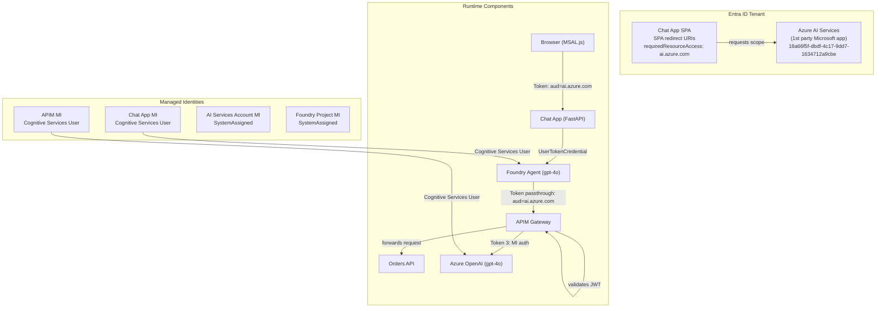
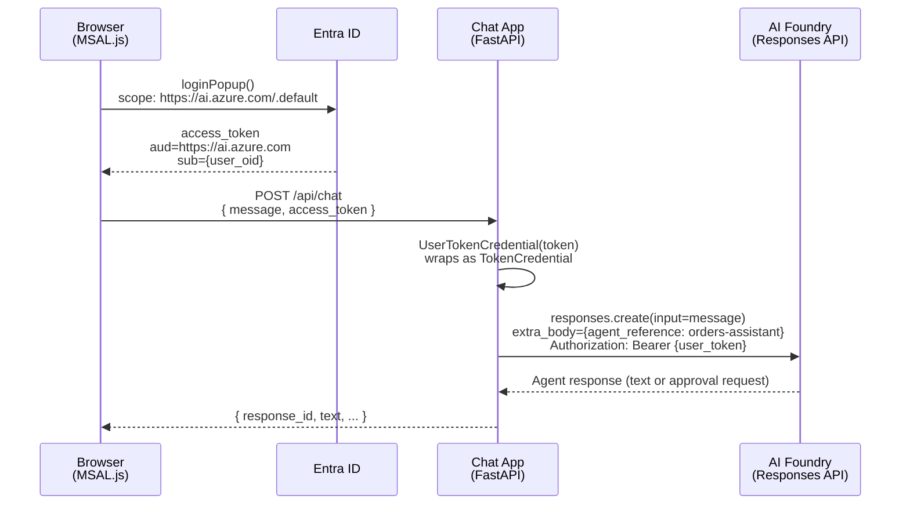
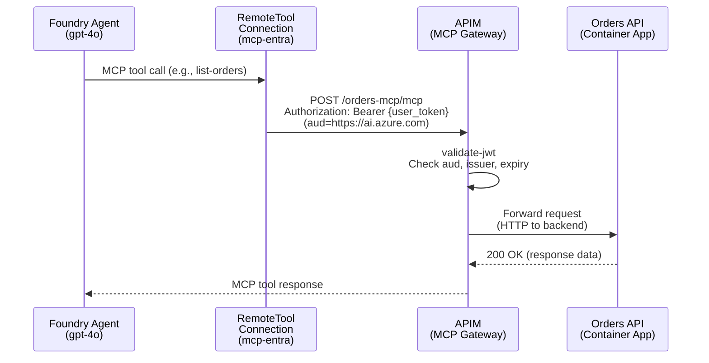
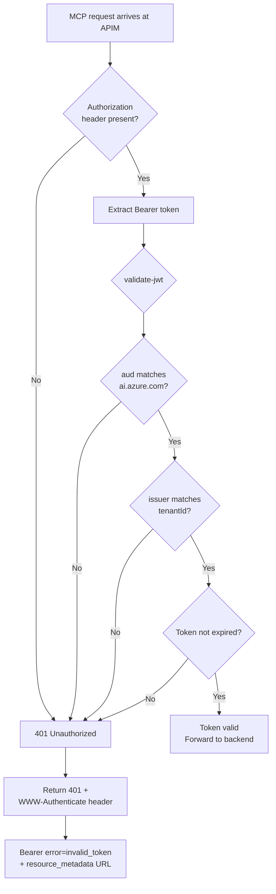
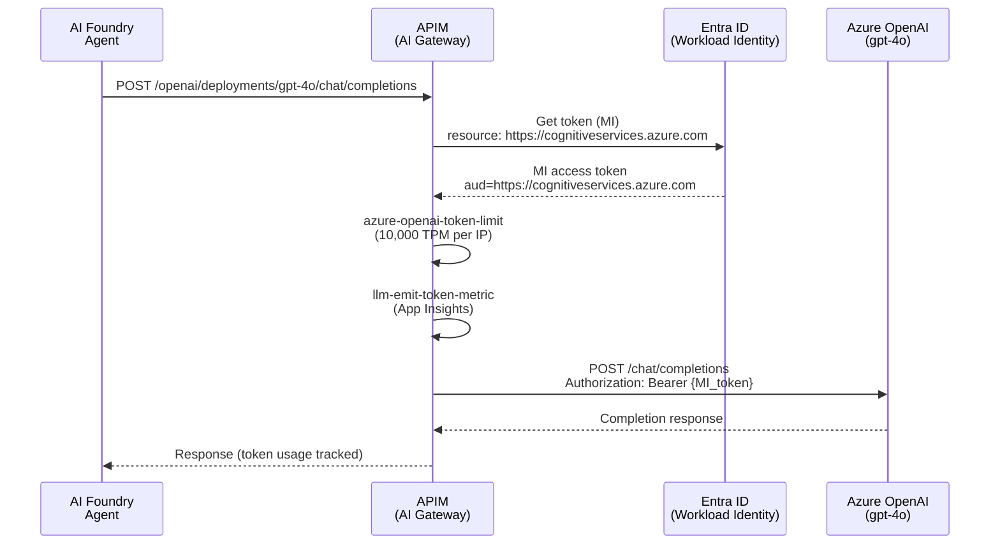
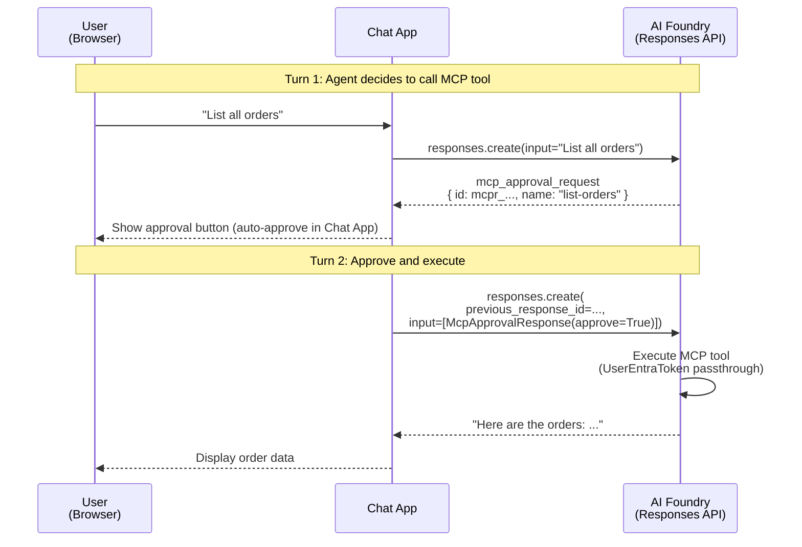
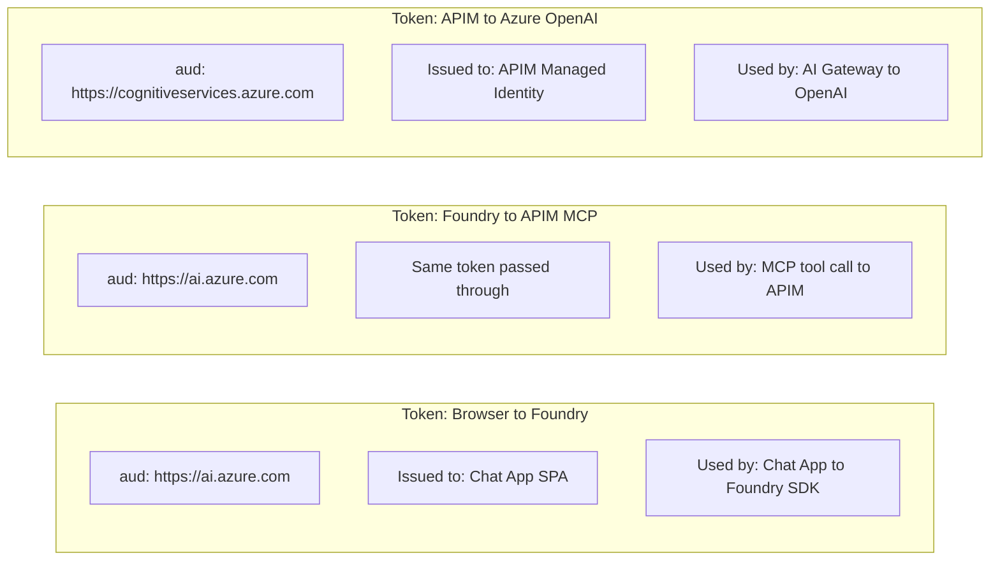

# Identity & Security Architecture

## 1. Introduction

This document describes the identity and security architecture of the Identity Propagation PoC. It covers the Entra ID app registration, managed identities, auth flows, APIM token validation policy, and all supporting configuration across Bicep, postprovision hook, APIM policies, and application code.

**Core principle: no service accounts in the data path.** A user's identity propagates end-to-end from the browser through the AI agent to the backend API. The only managed-identity flow is the AI Gateway path (APIM to Azure OpenAI), which is outside the user data path.

**Scope:** 1 Entra app registration, 4 managed identities, 3 distinct auth flows, APIM JWT validation with RFC 9728 Protected Resource Metadata, and all supporting configuration across Bicep, postprovision hook, APIM policies, and application code.

---

## 2. Identity Components

### Overview



### Entra App Registration

The Chat App SPA is created by the **postprovision hook** (`hooks/postprovision.py`) using `az` CLI with delegated permissions. The ARM deployment identity lacks `Application.ReadWrite.All` in managed tenants, so the Graph Bicep extension cannot be used.

| Property | Chat App SPA |
|----------|--------------|
| **Display Name** | `Chat App ({env})` |
| **Purpose** | Browser MSAL.js authentication for Chat UI |
| **App Type** | Public client (`isFallbackPublicClient: true`) |
| **Sign-in Audience** | `AzureADMyOrg` (single tenant) |
| **Redirect URIs** | SPA: `http://localhost:8080`, `https://{chatAppFqdn}` |
| **Required Resource Access** | Azure AI Services / `user_impersonation` (`18a66f5f-dbdf-4c17-9dd7-1634712a9cbe`) |
| **Credentials** | None (public SPA) |
| **Created By** | Postprovision hook Step 1 |
| **azd Env Var** | `CHAT_APP_ENTRA_CLIENT_ID` |

### Managed Identities

| Identity | Resource | Type | RBAC Role | Scope | Purpose |
|----------|----------|------|-----------|-------|---------|
| APIM MI | `apim-{env}` | SystemAssigned | `Cognitive Services User` | AI Services account (`aoai-{env}`) | Authenticate to Azure OpenAI via `authentication-managed-identity` policy |
| Chat App MI | `ca-chat-app` | SystemAssigned | `Cognitive Services User` | AI Services account (`aoai-{env}`) | Available for service-to-service auth (not used in data path; user token used instead) |
| AI Services MI | `aoai-{env}` | SystemAssigned | (none assigned) | N/A | Resource-level identity for the CognitiveServices account |
| Foundry Project MI | `aiproj-{env}` | SystemAssigned | (none assigned) | N/A | Resource-level identity for the Foundry project |

**RBAC role assignments** are deployed via `infra/modules/role-assignment.bicep`:
- Role: `Cognitive Services User` (`a97b65f3-24c7-4388-baec-2e87135dc908`)
- Assignment name: `guid(accountId, principalId, roleDefinitionId)` (deterministic)

---

## 3. Flow A: User to Chat App to Foundry (Delegated Identity)

### Narrative

1. **MSAL.js login** — The user clicks "Sign in" in the browser. MSAL.js opens a popup to `https://login.microsoftonline.com/{tenantId}` requesting `scope: https://ai.azure.com/.default`.
2. **Token acquisition** — Entra ID returns an access token with `aud=https://ai.azure.com` and the user's `oid`/`sub` claims. MSAL.js caches the token in `sessionStorage`.
3. **Chat request** — The browser sends `POST /api/chat { message, access_token }` to the Chat App backend. The access token is passed in the request body (not an Authorization header).
4. **UserTokenCredential** — The Chat App wraps the user's token in a `UserTokenCredential` class that implements the `TokenCredential` interface. This makes the Foundry SDK carry the user's identity.
5. **Foundry SDK call** — `AIProjectClient(endpoint, credential)` is instantiated with the wrapped token. The chat handler calls `openai_client.responses.create()` with `extra_body={"agent_reference": {"name": "orders-assistant", "type": "agent_reference"}}`.
6. **Identity propagation** — The Foundry service receives the request authenticated as the user, not as a service principal. The user's identity is preserved for downstream MCP tool calls.

### Sequence Diagram



### Configuration

| Setting | Value | Source |
|---------|-------|--------|
| SPA Client ID | `CHAT_APP_ENTRA_CLIENT_ID` | Postprovision hook Step 1 |
| Authority | `https://login.microsoftonline.com/{tenantId}` | `/api/config` endpoint |
| Scopes | `["https://ai.azure.com/.default"]` | `/api/config` endpoint |
| Foundry Endpoint | `AI_FOUNDRY_PROJECT_ENDPOINT` | Bicep output (`cognitive.outputs.projectEndpoint`) |
| Agent Name | `AGENT_NAME` (default: `orders-assistant`) | Container App env var |
| Resource App ID | `18a66f5f-dbdf-4c17-9dd7-1634712a9cbe` (Azure Machine Learning Services) | SPA `requiredResourceAccess` |
| Scope Permission ID | `1a7925b5-f871-417a-9b8b-303f9f29fa10` (`user_impersonation`) | SPA `requiredResourceAccess` |

### Key Design Decisions

- **Token in request body, not Authorization header:** The SPA sends the access token inside the JSON body rather than as a Bearer header. This avoids CORS preflight complexity and keeps the Chat App stateless.
- **Single-audience credential:** `UserTokenCredential` serves a single audience (`https://ai.azure.com`). The chat handler must not call APIs that require different audiences (e.g., `agents.list()` would fail).
- **Managed identity available but unused in data path:** The Chat App has a `SystemAssigned` MI with `Cognitive Services User` role, but it is not used for agent calls. The user's own token is passed through to preserve identity propagation.

---

## 4. Flow B: Foundry Agent to MCP Server via APIM (UserEntraToken)

### Narrative

1. **Agent decides to call MCP tool** — When the agent determines it needs to call an MCP tool (e.g., `list-orders`), it looks up the `mcp-entra` RemoteTool connection on the Foundry project.
2. **Token passthrough** — The UserEntraToken connection passes the user's existing Entra token (`aud=https://ai.azure.com`) directly to APIM. No OAuth2 client flow, no consent prompts, no refresh tokens.
3. **Bearer token sent to APIM** — The agent sends `POST /orders-mcp/mcp` to APIM with `Authorization: Bearer {token}`.
4. **APIM validates JWT** — The `validate-jwt` policy checks: audience matches `https://ai.azure.com`, issuer matches the tenant (v1 or v2 format), token is not expired.
5. **Request forwarded** — If valid, APIM forwards the request to the Orders API Container App backend.
6. **401 challenge on failure** — If validation fails, APIM returns `401 Unauthorized` with a `WWW-Authenticate` header pointing to the RFC 9728 Protected Resource Metadata endpoint.

### Sequence Diagram



### RemoteTool Connection Configuration

The connection is deployed via Bicep (`infra/modules/mcp-oauth-connection.bicep`) with `authType: UserEntraToken`. No postprovision hook steps are needed for this connection.

| Property | Value | Source |
|----------|-------|--------|
| `category` | `RemoteTool` | Required for Agent Service MCP tool recognition |
| `authType` | `UserEntraToken` | Passes user's existing Entra token directly |
| `target` | `{apimGatewayUrl}/orders-mcp/mcp` | APIM MCP endpoint |
| `metadata.type` | `custom_MCP` | Identifies as MCP connection |
| `metadata.audience` | `https://ai.azure.com` | Token audience for the user's token |
| `isSharedToAll` | `true` | Shared to all project users |

**Why UserEntraToken?** The user's MSAL.js token (`aud=https://ai.azure.com`) is the same audience that Foundry accepts. The UserEntraToken connection simply passes this token through to APIM, eliminating the need for a separate OAuth2 client flow, consent prompts, refresh tokens, and client secret management.

### APIM Token Validation

The `validate-jwt` policy is applied at the MCP API level (`infra/policies/mcp-api-policy.xml`):

```xml
<validate-jwt header-name="Authorization"
    failed-validation-httpcode="401"
    failed-validation-error-message="Unauthorized"
    require-scheme="Bearer"
    output-token-variable-name="jwt">
    <openid-config url="https://login.microsoftonline.com/{{McpTenantId}}/v2.0/.well-known/openid-configuration" />
    <audiences>
        <audience>https://ai.azure.com</audience>
    </audiences>
    <issuers>
        <issuer>https://login.microsoftonline.com/{{McpTenantId}}/v2.0</issuer>
        <issuer>https://sts.windows.net/{{McpTenantId}}/</issuer>
    </issuers>
</validate-jwt>
```

Both v1 and v2 issuers are needed — MSAL.js tokens may use either format.

On failure, the `on-error` section returns a 401 with a `WWW-Authenticate` header:

```
Bearer error="invalid_token", resource_metadata="{gateway}/orders-mcp/.well-known/oauth-protected-resource"
```

#### Token Validation Flowchart



### RFC 9728 Protected Resource Metadata

The PRM endpoint enables MCP clients to auto-discover the OAuth configuration needed to authenticate. It is served by a separate HTTP API (`orders-mcp-prm`) because MCP-type APIs do not support custom operations.

**Endpoint:** `GET {gateway}/orders-mcp/.well-known/oauth-protected-resource`

**Response** (generated by `infra/policies/mcp-prm-policy.xml`):

```json
{
  "resource": "{gateway}/orders-mcp/mcp",
  "authorization_servers": [
    "https://login.microsoftonline.com/{tenantId}/v2.0"
  ],
  "bearer_methods_supported": ["header"],
  "scopes_supported": [
    "https://ai.azure.com/.default"
  ]
}
```

- Served anonymously (no auth required)
- Cached: `Cache-Control: public, max-age=3600`
- The `resource` field matches the connection `target` (APIM MCP endpoint)

### APIM Named Values

| Named Value | Purpose | Value |
|-------------|---------|-------|
| `McpTenantId` | Tenant ID for issuer validation | `tenant().tenantId` (set at deploy) |
| `APIMGatewayURL` | Gateway URL for PRM response | `apim.properties.gatewayUrl` (set at deploy) |

---

## 5. Flow C: APIM to Azure OpenAI (Managed Identity)

### Narrative

The AI Gateway flow uses **managed identity** authentication. When the Foundry agent calls the Azure OpenAI API through APIM, the APIM `authentication-managed-identity` policy acquires a token using APIM's system-assigned managed identity. No user tokens are involved — this is pure service-to-service auth.

This flow is separate from the user data path. It handles the agent's own LLM inference calls.

### Sequence Diagram



### Configuration

| Setting | Value | Source |
|---------|-------|--------|
| APIM Identity | `SystemAssigned` | `infra/modules/apim.bicep` |
| RBAC Role | `Cognitive Services User` | `infra/modules/role-assignment.bicep` |
| RBAC Scope | AI Services account (`aoai-{env}`) | `infra/main.bicep` (module `apim-cognitive-role`) |
| Policy: `authentication-managed-identity` | `resource=https://cognitiveservices.azure.com` | `infra/policies/ai-gateway-policy.xml` |
| Policy: `azure-openai-token-limit` | 10,000 TPM per IP | `infra/policies/ai-gateway-policy.xml` |
| Policy: `llm-emit-token-metric` | Dimensions: API ID, Operation ID, Client IP, Deployment | `infra/policies/ai-gateway-policy.xml` |
| Backend | `openai-backend` → `{cognitiveEndpoint}openai` | `infra/modules/apim.bicep` |

---

## 6. MCP Tool Approval Flow

### Responses API Output Item Types

When the Foundry agent calls an MCP tool, the Responses API returns an `mcp_approval_request` that the client must approve before execution proceeds.

| Type | Field | Description |
|------|-------|-------------|
| `mcp_approval_request` | `id` | Approval request ID (prefix: `mcpr_...`) |
| `mcp_approval_request` | `name` | Tool name (e.g., `list-orders`) |
| `mcp_approval_request` | `server_label` | MCP server label (e.g., `orders_mcp`) |
| `mcp_approval_request` | `arguments` | Tool call arguments (dict) |
| `message` | `content[].text` | Agent text response |

### Multi-Turn Flow



---

## 7. Token Audiences Summary

### Visual Overview



### Summary Table

| Flow | Audience | Issued To | Auth Type | User Identity Propagated? |
|------|----------|-----------|-----------|--------------------------|
| Browser to Foundry | `https://ai.azure.com` | Chat App SPA (MSAL.js) | Delegated (user interactive) | Yes |
| Foundry to APIM MCP | `https://ai.azure.com` | Same user token (UserEntraToken passthrough) | Delegated (token passthrough) | Yes (`sub={user_oid}`) |
| APIM to Azure OpenAI | `https://cognitiveservices.azure.com` | APIM system-assigned MI | App-only (managed identity) | No (service identity) |

This is the most common source of configuration errors. Each component expects a specific audience — using the wrong one results in `401 Unauthorized` or `AADSTS650057`.

---

## 8. Security Design Decisions

1. **No service accounts in the data path.** User identity propagates from browser through agent to API. The only MI-based flow is AI Gateway (APIM to OpenAI), which is outside the user data path.

2. **UserEntraToken passthrough, not OAuth2 client flow.** The Foundry-to-APIM flow uses UserEntraToken, meaning the user's existing token (`aud=https://ai.azure.com`) is passed directly to APIM. No separate OAuth2 client, no consent flow, no refresh tokens, no client secrets.

3. **Public client for SPA.** The Chat App SPA uses `isFallbackPublicClient: true` because browsers cannot securely store secrets.

4. **Single-tenant app only.** The Chat App SPA uses `signInAudience: AzureADMyOrg`. This restricts authentication to users in the PoC tenant only, preventing cross-tenant access.

5. **Response body logging disabled for MCP.** APIM Application Insights response body logging at the All APIs scope **breaks MCP SSE streaming**. Response buffering interferes with the SSE transport, causing the MCP endpoint to hang indefinitely. Frontend and backend response body bytes are set to `0` in the global diagnostics configuration (`infra/modules/apim.bicep`).

6. **No credentials to manage.** With UserEntraToken, there are no client secrets, no refresh tokens, and no credentials that need rotation. The only Entra app (Chat App SPA) is a public client with no credentials.

7. **RFC 9728 Protected Resource Metadata.** The PRM endpoint at `/.well-known/oauth-protected-resource` enables MCP clients to auto-discover the authorization server, supported scopes, and bearer methods. This follows the standard for protected resource metadata rather than requiring out-of-band configuration.

8. **Backend trust boundary (APIM as gateway).** The Orders API Container App does not perform its own authentication — it trusts APIM as the security boundary. All token validation happens at the APIM layer. This is acceptable for a PoC; production would add backend auth.

---

## 8.5. Sign-in Log Auditing

### Overview

Entra ID sign-in logs (`auditLogs/signIns` via Microsoft Graph API) provide visibility into token issuance events for the Chat App SPA registration. This shows when users authenticate via MSAL.js in the browser.

### What Each Auth Flow Produces in Sign-in Logs

| Auth Flow | App in Sign-in Log | Sign-in Type | Log Table |
|-----------|--------------------|--------------|-----------|
| Browser → Chat App (MSAL.js login) | Chat App SPA | Interactive (`SigninLogs`) | `SigninLogs` |
| APIM → Azure OpenAI (managed identity) | APIM service principal | Service principal | `AADServicePrincipalSignInLogs` |

### Fields Available Per Sign-in Event

| Field | Description | Useful For |
|-------|-------------|------------|
| `createdDateTime` | Timestamp of token issuance | Correlating with APIM gateway logs |
| `userDisplayName` / `userPrincipalName` | User who authenticated | Verifying identity propagation |
| `appDisplayName` | App registration that requested the token | Identifying which flow triggered |
| `resourceDisplayName` | Target resource (audience) | Verifying correct audience |
| `status.errorCode` | `0` = success, `AADSTS*` = failure | Diagnosing auth errors |
| `ipAddress` | Client IP address | Security auditing |
| `conditionalAccessStatus` | `success` / `failure` / `notApplied` | CA policy impact |
| `location` | City/country from IP geolocation | Security auditing |

### Access Methods

| Method | Requirement | Notes |
|--------|-------------|-------|
| **Workbook "OAuth Audit" tab** | Entra ID diagnostic settings → Log Analytics | Queries `SigninLogs` and `AADServicePrincipalSignInLogs` KQL tables. Requires Security Admin role to configure diagnostic settings. |
| **`scripts/check-signin-logs.py`** | `AuditLog.Read.All` delegated permission via `az login` | Queries Graph API directly. Works immediately without diagnostic settings. Supports `--hours` and `--app-filter` flags. |

### Entra Diagnostic Settings Constraint

Routing Entra sign-in logs to Log Analytics (required for the workbook tab) requires configuring **Entra ID → Diagnostic settings**. This requires the **Security Admin** role, which is unavailable in managed tenants where the user has only Global Reader access.

**Workaround:** Use `scripts/check-signin-logs.py` which queries the Graph API directly with the `AuditLog.Read.All` delegated permission available to the current `az login` user.

---

## 9. Configuration Reference

### Entra App Settings: Chat App SPA

| Property | Value |
|----------|-------|
| `displayName` | `Chat App ({env})` |
| `signInAudience` | `AzureADMyOrg` |
| `isFallbackPublicClient` | `true` |
| `spa.redirectUris` | `["http://localhost:8080", "https://{chatAppFqdn}"]` |
| `requiredResourceAccess[0].resourceAppId` | `18a66f5f-dbdf-4c17-9dd7-1634712a9cbe` (Azure AI Services) |
| `requiredResourceAccess[0].resourceAccess[0].id` | `1a7925b5-f871-417a-9b8b-303f9f29fa10` (`user_impersonation`) |
| Service Principal | Created by hook (Step 1) |

### RBAC Role Assignments

| Assignment | Principal | Role | Scope | Deployed By |
|------------|-----------|------|-------|-------------|
| APIM to Cognitive Services | APIM MI (`apim.outputs.apimPrincipalId`) | `Cognitive Services User` | `aoai-{env}` account | Bicep (`apim-cognitive-role`) |
| Chat App to Cognitive Services | Chat App MI (`chatApp.outputs.chatAppPrincipalId`) | `Cognitive Services User` | `aoai-{env}` account | Bicep (`chat-app-cognitive-role`) |

### Container App Environment Variables

#### Chat App (`ca-chat-app`)

| Variable | Value | Set By |
|----------|-------|--------|
| `AI_FOUNDRY_PROJECT_ENDPOINT` | `https://aoai-{env}.services.ai.azure.com/api/projects/aiproj-{env}` | Bicep (`chat-app.bicep`) |
| `AGENT_NAME` | `orders-assistant` | Bicep (`chat-app.bicep`) |
| `CHAT_APP_ENTRA_CLIENT_ID` | `{Chat App SPA appId}` | Postprovision hook Step 3 (`az containerapp update`) |
| `TENANT_ID` | `{tenantId}` | Postprovision hook Step 3 |

### azd Environment Variables (Set by Postprovision Hook)

| Variable | Description | Set By |
|----------|-------------|--------|
| `CHAT_APP_ENTRA_CLIENT_ID` | Chat App SPA app ID | Hook Step 1 (`azd env set`) |

This variable persists in the azd environment and is used by scripts (`verify_deployment.py`, `check-signin-logs.py`, `test-agent.py`).

---

## 10. Appendix: Postprovision Hook Steps

The postprovision hook (`hooks/postprovision.py`) runs after Bicep deployment completes. From an identity perspective, it performs these steps:

1. **Step 1: Create Chat App Entra registration**
   - Create SPA app registration with redirect URIs for localhost and deployed FQDN.
   - PATCH `requiredResourceAccess` for Azure AI Services (`user_impersonation`).
   - Create service principal. Set `CHAT_APP_ENTRA_CLIENT_ID` via `azd env set`.

2. **Step 2: Create Foundry agent**
   - Create `orders-assistant` with `MCPTool` referencing the `mcp-entra` connection and the MCP endpoint.
   - The agent's `project_connection_id` links to the UserEntraToken connection.

3. **Step 3: Update Chat App settings**
   - `az containerapp update` to set `CHAT_APP_ENTRA_CLIENT_ID`, `TENANT_ID`, and `AGENT_NAME` environment variables on `ca-chat-app`.
